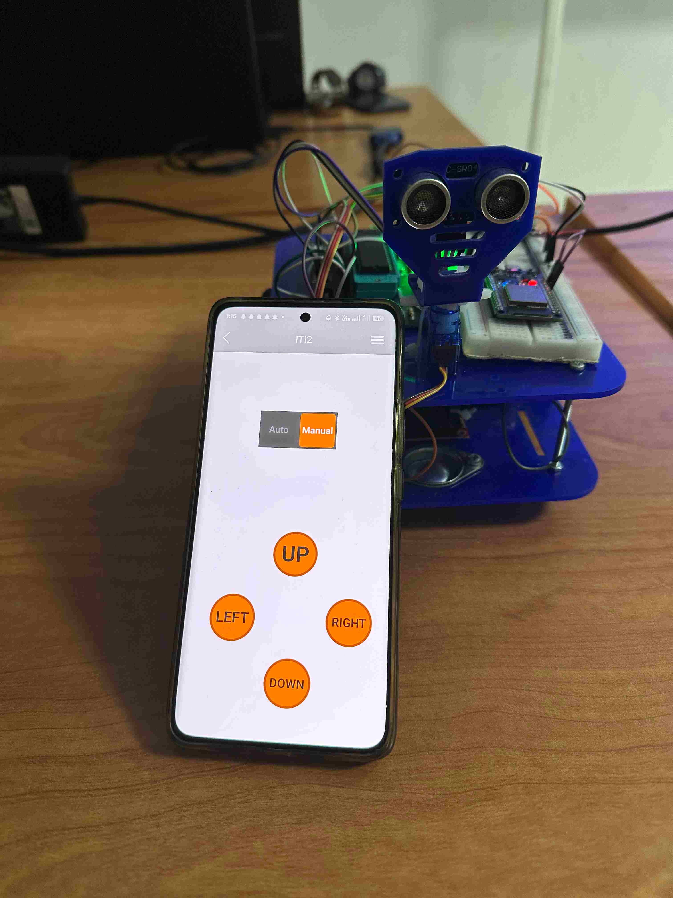

# 🚗 Autonomous RC Car  

This is my **final graduation project** with **ITI Embedded AVR** under the title:  
**Autonomous RC Car**  

The project implements a small-scale RC car that can be controlled in two modes:  
- **Manual Mode** → controlled via a mobile app (RemoteXY).  
- **Autonomous Mode** → the car navigates automatically using ultrasonic sensors and servo for obstacle detection.  

---

## 📌 Features  

- **Dual Control Modes**  
  - Manual mode using **ESP32 + RemoteXY App**.  
  - Autonomous mode using **ultrasonic sensors** for obstacle detection.  

- **Custom HAL & MCAL Drivers**  
  - All drivers (GPIO, UART, Timer, PWM, ADC, etc.) implemented from scratch.  

- **Communication**  
  - **ESP32 ↔ ATmega32** via UART.  
  - RemoteXY app connected through ESP32 Wi-Fi.  

- **Motor Control**  
  - **L298 Motor Driver** to control DC motors.  
  - Steering controlled via **servo motor**.  

- **Power Supply**  
  - **LM2596HVS step-down regulator** for stable power to ESP32, sensors, and ATmega32.  

---

## 🛠️ Hardware Components  

- ATmega32 (main controller, running HAL/MCAL drivers).  
- ESP32 (Wi-Fi & RemoteXY app interface).  
- Ultrasonic sensor (HC-SR04) for obstacle detection.  
- Servo motor (steering).  
- DC Motors + L298 Motor Driver.  
- LM2596HVS Power Regulator.  
- (Optional) GSM SIM800L module (tested but not working in current version).  

---

## 📲 Software & Tools  

- **MCAL & HAL drivers** (self-implemented).  
- **RemoteXY App** (for manual control).  
- **Embedded C** for ATmega32 firmware.  
- **UART communication** between ATmega32 and ESP32.  

---

## 🚀 Future Work  

- Add **GPS** module for navigation.  
- Add **NRF24L01** wireless module for communication.  
- Improve **GSM (SIM800L) support** for remote monitoring.  

---

## 🔄 Project Flowchart

---
## 🖥️ Simulation (Proteus)  

The project was first simulated in **Proteus** to validate hardware connections and driver implementation before testing on the real car.  

 
---

## 📷 Project Media  

### 🔹 Manual  
  

### 🔹 Autonomous   
  

---

## 👨‍👩‍👧‍👦 Team Members  

- Marina Said  
- Mohammed El-Hofy  
- Shimaa Moustafa  
- Moustafa Nader  

---

## 🎓 Instructors  

- Mohammed Gasser  
- Abdullahel Zohiery  

---

## 📍 Project Info  

- **Field:** Embedded Systems & AVR Development  
- **Institute:** ITI Embedded AVR  

---
